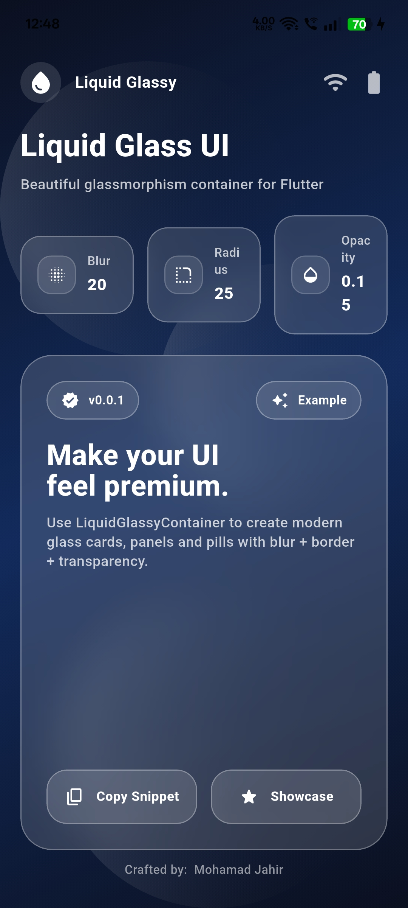

# Liquid Glassy Container

A modern and customizable **glassmorphism (liquid glass)** container widget for Flutter.

Create beautiful frosted glass UI components with blur, border, and transparency effects — perfect for modern dashboards, cards, panels, and premium interfaces.

---

## ✨ Features

-  Beautiful glassmorphism effect
-  Adjustable blur intensity
-  Custom border radius
-  Width & height control
-  Adjustable opacity
-  Clean and simple API
-  Lightweight & easy to use

---

## 📦 Installation

Add this to your `pubspec.yaml`:

```yaml
dependencies:
  liquid_glassy_container: ^0.0.1

```
Then Run: `flutter pub get` to install the package.

## 🚀 Usage

Import the package: `import 'package:liquid_glassy_container/liquid_glassy_container.dart';`

Basic example: 

```dart

void main() {
  runApp(const MyApp());
}

class MyApp extends StatelessWidget {
  const MyApp({super.key});

  @override
  Widget build(BuildContext context) {
    return const MaterialApp(
      debugShowCheckedModeBanner: false,
      home: DemoScreen(),
    );
  }
}

class DemoScreen extends StatelessWidget {
  const DemoScreen({super.key});

  @override
  Widget build(BuildContext context) {
    return Scaffold(
      body: Stack(
        fit: StackFit.expand,
        children: [
          // Background Gradient
          Container(
            decoration: const BoxDecoration(
              gradient: LinearGradient(
                begin: Alignment.topLeft,
                end: Alignment.bottomRight,
                colors: [
                  Color(0xFF0F2027),
                  Color(0xFF203A43),
                  Color(0xFF2C5364),
                ],
              ),
            ),
          ),

          // Center Glass Container
          Center(
            child: LiquidGlassyContainer(
              width: 300,
              height: 200,
              blur: 20,
              borderRadius: 25,
              opacity: 0.15,
              child: const Center(
                child: Text(
                  "Liquid Glass Effect",
                  style: TextStyle(
                    fontSize: 22,
                    color: Colors.white,
                    fontWeight: FontWeight.bold,
                  ),
                ),
              ),
            ),
          ),
        ],
      ),
    );
  }
}


```
## 📸 Preview
 


## 🎛 Parameters

| Parameter      | Type     | Default  | Description                         |
|---------------|----------|----------|-------------------------------------|
| child         | Widget   | required | Content inside glass container      |
| blur          | double   | 15       | Background blur intensity           |
| borderRadius  | double   | 20       | Corner radius                       |
| opacity       | double   | 0.15     | Glass fill opacity                  |
| width         | double?  | null     | Custom width                        |
| height        | double?  | null     | Custom height                       |


## ❤️ Support

If you like this package, consider giving it a ⭐ on GitHub.

🔗 GitHub Repository:  
https://github.com/jahir123695/glassy_container_package.git

---

Crafted with 🤎 by Mohamad Jahir
